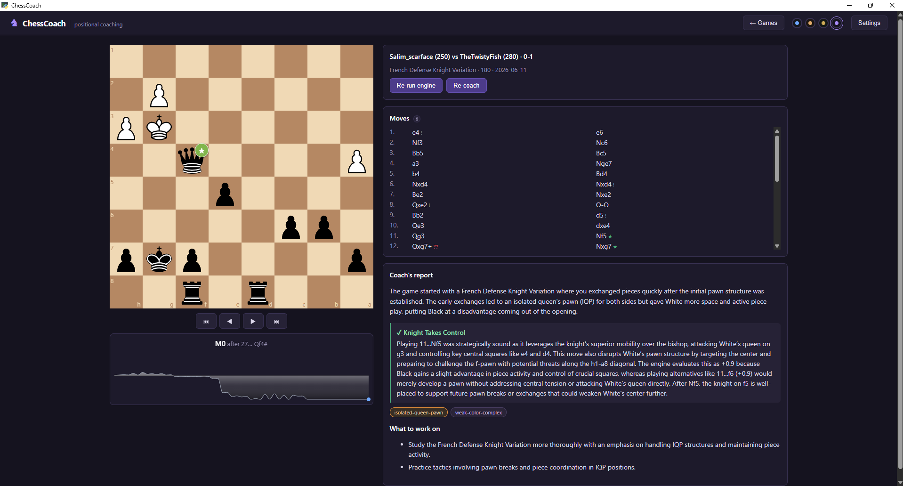
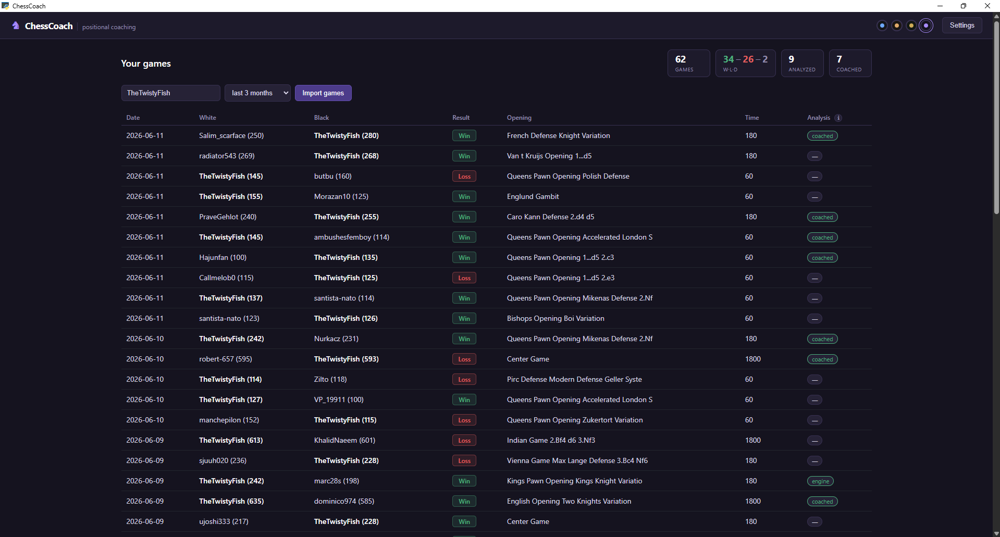
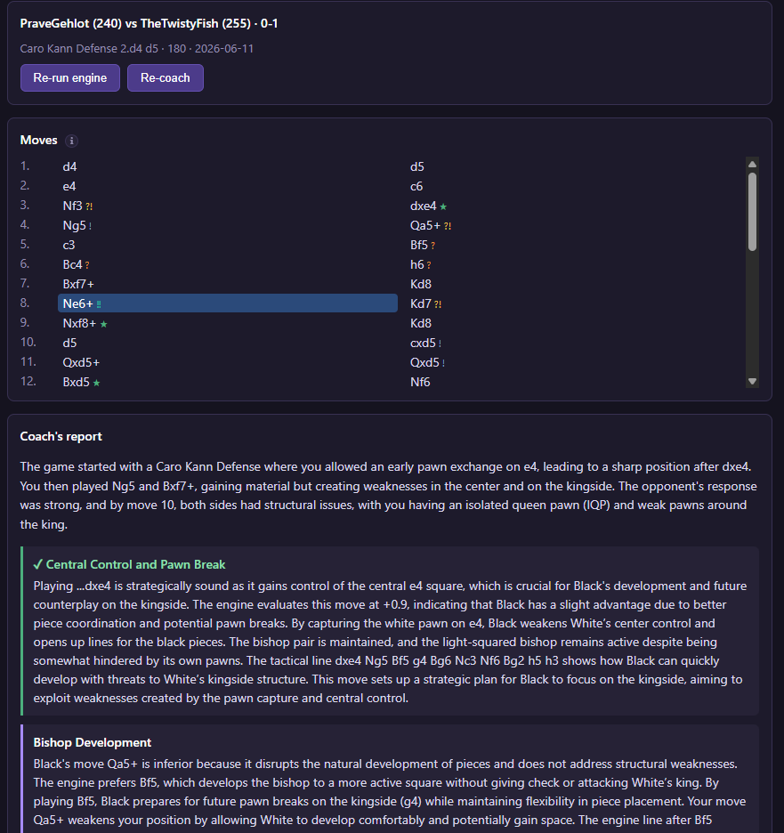
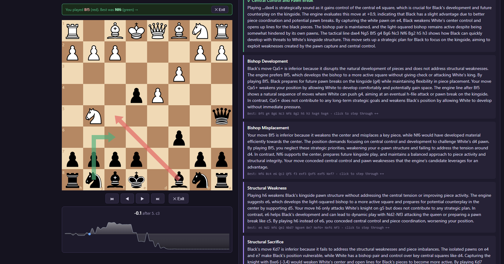
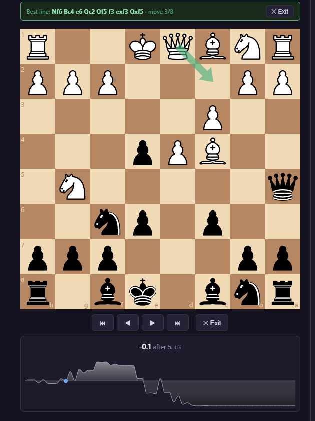

# ♞ ChessCoach

**Free, local positional chess coaching for your own games.** Stockfish handles the
tactics; a local LLM explains the *strategic why* — the plans, pawn structures, and
piece-quality decisions that an eval bar never tells you.

Most analysis tools are great at "−1.4, blunder" and useless at "you keep entering
isolated-queen-pawn positions without a plan." ChessCoach is built for the second kind —
and it runs entirely on your own machine, for free.



## Why it's different

- **Positional, not just tactical.** Per key moment, the coach interprets the engine's
  candidate moves into human strategy: which side is better and *why*, the imbalance
  (good vs. bad bishop, knight vs. bishop in this structure), the plan, the squares to
  fight for — then grounds it in concrete lines.
- **Grounded, not hallucinated.** The model never parses a raw board. It's fed an exact
  piece roster and deterministic move consequences (computed from the rules of chess), and
  it's forbidden from claiming any attack/threat the data doesn't confirm. No invented pieces.
- **Free and local by default.** Coaching runs on a local LLM via [Ollama](https://ollama.com);
  the engine is Stockfish. No subscriptions, no per-game cost. (An optional Claude API path
  exists if you'd rather use it.)

## Features

- chess.com game import (free public API)
- Full Stockfish pass with lichess-style win% move grades — **‼ brilliant · ! great · ★ best · ✓ good · ?! inaccuracy · ? mistake · ?? blunder** — shown on the board and move list
- Eval graph with click-to-jump
- Per-moment coaching with engine candidate moves interpreted positionally
- Variation step-through that contrasts **what you played (red)** vs. **the engine's best line (green)**
- Strategic theme tagging (bad bishop, weak color complex, no-plan drift, …) stored
  normalized in SQLite — designed so cross-game weakness profiling is a `GROUP BY`
- Four built-in color themes (Midnight, Walnut, Forest, Royal)

## Screenshots

| Game list / dashboard | Coaching report |
| --- | --- |
|  |  |

**Variation walkthrough** — click a key moment to compare what you played (red) against
the engine's best line (green), then step deeper to see the position a better plan reaches:

| Decision point: played vs. best | Stepping into the better line |
| --- | --- |
|  |  |

## Requirements

- **Windows** (primary target — the desktop shell uses WebView2). Other OSes can run the
  web app directly; you'll just need the matching Stockfish binary.
- **Python 3.11+**
- **Node 20+**
- **[Ollama](https://ollama.com)** + a model (default `qwen2.5:14b`, ~9 GB, runs best on a
  GPU with ≥10 GB VRAM) — *or* an Anthropic API key for the optional Claude path
- **Stockfish** (downloaded separately — GPLv3)

## Setup

```powershell
# 1. Clone
git clone https://github.com/<you>/ChessCoach.git
cd ChessCoach

# 2. Python backend
python -m venv .venv
.venv\Scripts\python.exe -m pip install -r requirements.txt

# 3. Stockfish — download from https://stockfishchess.org/download/
#    and place the binary at:  engines\stockfish.exe

# 4. Frontend (build the bundle the desktop app serves)
cd frontend
npm install
npm run build
cd ..

# 5. Coaching engine — install Ollama from https://ollama.com, then:
ollama pull qwen2.5:14b
```

## Run

```powershell
.venv\Scripts\python.exe desktop.py
```

(or double-click `launch.bat`). A first-run checklist in the app walks you through
connecting your chess.com account and your first analysis.

## Workflow

1. **Import games** — pulls your chess.com archive.
2. Open a game → **Run engine analysis** — Stockfish evaluates every move, grades them,
   and draws the eval graph (~10–30s).
3. **Get coaching** — one focused pass per key moment plus a game summary (~1–3 min on a
   local 14B model), producing the strategic report, theme tags, and study takeaways.

## Coaching backends

Set in the app's **Settings** screen:

- **Ollama (default, free)** — local LLM. `qwen2.5:14b` recommended for the best grounding;
  smaller models (`llama3.1:8b`, `gemma2:9b`) work with less depth.
- **Claude API (optional, paid)** — higher quality, a few cents per game, needs an Anthropic
  API key.

## Development

```powershell
# backend tests
.venv\Scripts\python.exe -m pytest tests

# backend only (API on :8421)
.venv\Scripts\python.exe -m uvicorn backend.app:app --port 8421

# frontend dev server (proxies /api to :8421)
cd frontend; npm run dev
```

## Architecture

- `backend/engine.py` — Stockfish pass, win% move classification, MultiPV candidate moves
- `backend/features.py` — deterministic positional facts + exact piece roster + move
  consequences that ground the coach so it can't hallucinate the board
- `backend/coach.py` — per-moment + summary LLM calls; theme slugs are a controlled
  vocabulary stored normalized in SQLite
- `frontend/` — React + react-chessboard + recharts
- `desktop.py` — pywebview (WebView2) shell around the FastAPI server

## License

[MIT](LICENSE) for ChessCoach's own code. Stockfish is GPLv3 and is invoked as a separate
process (downloaded by you, not bundled) — see the note in [LICENSE](LICENSE). chess.com
data is accessed via their public API; respect their terms of service.
